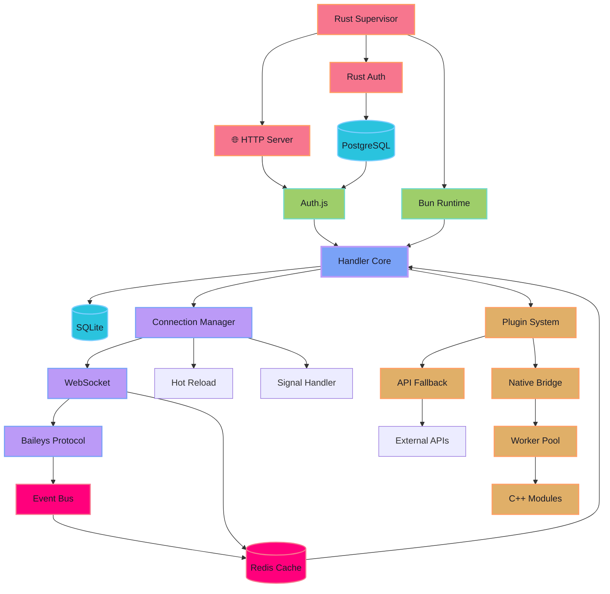

<div align="center">


**🌸 Liora**

> **Enterprise-Grade WhatsApp Bot Framework**

**Built on Baileys • Powered by Bun • Supervised by Rust • Cached with Redis • Persisted by PostgreSQL**

<p align="center">
<a href="https://bun.sh">

</a>
<a href="https://www.rust-lang.org">

</a>
<a href="https://www.postgresql.org">

</a>
<a href="https://redis.io">

</a>
<a href="https://ffmpeg.org">

</a>
<a href="https://www.sqlite.org">

</a>
<a href="https://cmake.org">

</a>
<a href="https://nodejs.org">

</a>
<a href="https://developer.mozilla.org/en-US/docs/Web/JavaScript">

</a>
<a href="https://isocpp.org">

</a>
<a href="https://www.kernel.org">

</a>
<a href="LICENSE">

</a>
</p>

<p align="center">
<a href="https://github.com/naruyaizumi/liora/actions/workflows/01-code-quality.yml">

</a>
<a href="https://github.com/naruyaizumi/liora/actions/workflows/01-code-quality.yml">

</a>
<a href="https://github.com/naruyaizumi/liora/actions/workflows/04-documentation.yml">

</a>
<a href="https://github.com/naruyaizumi/liora/actions/workflows/02-security-scan.yml">

</a>
<a href="https://github.com/naruyaizumi/liora/actions/workflows/03-build-test.yml">

</a>
<a href="https://github.com/naruyaizumi/liora/actions/workflows/10-deployment.yml">

</a>
</p>

<p align="center">
<a href="https://github.com/naruyaizumi/liora/commits/main">

</a>
<a href="https://github.com/naruyaizumi/liora/releases">

</a>
<a href="https://github.com/naruyaizumi/liora/stargazers">

</a>
<a href="https://github.com/naruyaizumi/liora/network/members">

</a>
<a href="https://github.com/naruyaizumi/liora/issues">

</a>
</p>

<p align="center">
<a href="https://github.com/naruyaizumi/liora">

</a>
<a href="https://gitlab.com/naruyaizumi/liora">

</a>
<a href="https://codeberg.org/naruyaizumi/liora">

</a>
<a href="https://gitea.com/naruyaizumi/liora">

</a>
<a href="https://bitbucket.org/naruyaizumi/liora">

</a>
<a href="https://dev.azure.com/naruyaizumi/_git/liora">

</a>
</p>


</div>

## 🎯 Why Liora?

<div align="center">

**Liora** is not just another WhatsApp bot—it's a **production-ready framework** designed for developers who demand **performance**, **reliability**, and **scalability**. Built with modern technologies and battle-tested architecture patterns.

</div>

<table>
<tr>
<td width="33%" align="center">


**⚡ Blazing Fast**

Native Bun runtime with Rust supervisor delivers unmatched performance. Zero-downtime hot-reload keeps your bot running 24/7.

</td>
<td width="33%" align="center">


**🔒 Battle-Tested**

Enterprise-grade security with PostgreSQL persistence, Redis caching, and comprehensive input sanitization.

</td>
<td width="33%" align="center">


**🧩 Developer First**

Hot-reload plugins, ESM modules, type-safe patterns, and clean architecture make development a breeze.

</td>
</tr>
</table>

<div align="center">

</div>

## 🏗 Architecture Overview

<div align="center">



</div>

<div align="center">

</div>

## ⚠️ Important Notices

<div align="center">

<table>
<tr>
<td width="33%" align="center">

**🚨 Breaking Changes**


**Version 8.0.0** introduces major architecture changes. Migration from v7.x requires database setup and configuration updates.

</td>
<td width="33%" align="center">

**🛡 Security**


Found a vulnerability? **Do not** disclose publicly. Report responsibly through our security policy.

[Security Policy →](.github/SECURITY.md)

</td>
<td width="33%" align="center">

**⚖️ License*


Apache 2.0 allows free use with attribution. **Do not** remove credits or rebrand for profit.

[Read License →](LICENSE)

</td>
</tr>
</table>

</div>

<div align="center">

</div>

## ✨ Feature Highlights

<table>
<tr>
<td width="50%" valign="top">

**🔥 Production Architecture**

 **Multi-Process Isolation**
Rust supervisor manages Bun child processes with automatic crash recovery

 **Zero-Downtime Deployment**
Hot-reload plugins and graceful restarts keep your bot online

 **Health Monitoring**
Built-in watchdog with automatic recovery and alerts

 **Signal Handling**
Proper SIGTERM/SIGINT handling for clean shutdowns

**⚡ High Performance**

 **Native Bun WebSocket**
No `ws` dependency—pure performance with native APIs

 **Redis Connection Pool**
Optimized caching with persistent connections

 **Async Event Queue**
PQueue-based message processing prevents bottlenecks

 **Circuit Breaker**
Automatic API fallback prevents cascading failures

**🔒 Enterprise Security**

 **PostgreSQL Auth**
Persistent session storage with encryption at rest

 **Redis Encryption**
Encrypted cache with TTL-based cleanup

 **Input Sanitization**
Comprehensive validation prevents injection attacks

 **Rate Limiting**
Per-user and global limits with Redis-backed tracking

**🛡️ Group Management**

 **Anti-Link Protection**
Automatically detect and delete unauthorized links

 **Anti-Media Filter**
Auto-delete images/videos/audio with configurable rules

 **Admin Tools**
Promote/demote users with granular permissions

 **Group Rules**
Enforce group rules with automatic warnings

*Note: Group management features are regularly updated based on WhatsApp API changes*

</td>
<td width="50%" valign="top">

**🧩 Developer Experience**

 **Plugin Hot-Reload**
Update code without restarting—changes apply instantly

 **ESM Throughout**
Modern JavaScript modules with clean imports

 **Type-Safe Patterns**
JSDoc annotations provide IDE autocomplete

 **Clean Architecture**
SOLID principles with clear separation of concerns

**📊 Observability**

 **Structured Logging**
Pino-based JSON logs with trace IDs

 **Prometheus Metrics**
Built-in `/metrics` endpoint for monitoring

 **Health Checks**
`/health` and `/ready` probes for orchestration

 **Debug Mode**
Detailed traces with performance profiling

**🎥 Media Downloader Suite**

 **YouTube DL**
Download videos/audio in multiple formats

 **Spotify Audio**
Extract music from Spotify links

 **Instagram/TikTok**
Download Reels, Stories, and posts

 **Media Downloader**
Download videos/images/audio from various platforms

*Note: Media downloader support varies by platform and may change*

**🛠️ Advanced Message Features**

 **Unlimited Buttons**
Support for 15+ button types including Pix Key, Galaxy, no limit on quantity

 **All Media Support**
Buttons can include any media type - images, videos, audio, documents

 **Rich Message Types**
Group status payloads, card messages (carousel), album messages

 **Location & Product**
Support for location sharing and product catalog messages

**🔧 Utilities & Tools**

 **Image Processing**
Compress, convert, enhance images

 **Sticker Creation**
Create WhatsApp stickers with cropping and effects

 **IP/DNS Tools**
Check IP, reverse DNS, network information

 **Image Enhancement**
Enhance image quality with various algorithms

</td>
</tr>
</table>

<div align="center">
<small><em>All features are subject to continuous updates based on WhatsApp API changes and community feedback</em></small>
</div>

<div align="center">

</div>

## 🚀 Quick Start

<div align="center">

**⚡ One-Line Installation**

```bash
curl -sSL https://raw.githubusercontent.com/naruyaizumi/liora/main/service.sh | bash
```


**Minimum Requirements**

<table>
<tr>
<td width="50%">

**System**
- **OS**: Linux Kernel 6.12+
- **Distribution**: Ubuntu 24.04+, Debian 12+, Arch Linux
- **Architecture**: x86_64 / ARM64

**Hardware**
- **CPU**: 2 cores minimum
- **RAM**: 4GB (2GB with swap)
- **Storage**: 15GB SSD recommended
- **Network**: 100Mbps internet connection

</td>
<td width="50%">

**Dependencies**
- **Runtime**: Node.js 24+ / Bun 1.1+
- **Database**: PostgreSQL 16+ / SQLite 3.35+
- **Cache**: Redis 7+
- **Build Tools**: G++ 13+, CMake 3.28+

**Permissions**
- sudo/root access for system installation
- Port 3000+ available for services
- Write access to installation directory

</td>
</tr>
</table>

</div>

## 🤝 Contributing

<div align="center">


**Contributions are the heart of open source!** 💖

All contributions are valuable—bug fixes, features, documentation, or feedback.

</div>

**🌟 How to Contribute**

<table>
<tr>
<td align="center" width="33%">


*1 Fork & Clone*

```bash
git clone https://github.com/YOUR_USERNAME/liora.git
cd liora
```

Create your own copy

</td>
<td align="center" width="33%">


*2 Develop*

```bash
git checkout -b feature/amazing-feature
# Make your changes
bun run check
```

Write clean, tested code

</td>
<td align="center" width="33%">


*3 Submit*

```bash
git commit -m "✨ Add amazing feature"
git push origin feature/amazing-feature
```

Create a pull request

</td>
</tr>
</table>

*4. Contribution Guidelines*

<details>
<summary><b>💻 Code Standards</b></summary>

-   **Style**: Follow ESLint and Prettier configurations
-   **Commits**: Use [Conventional Commits](https://www.conventionalcommits.org/):
    -   `feat:` New features
    -   `fix:` Bug fixes
    -   `docs:` Documentation
    -   `style:` Formatting
    -   `refactor:` Code restructuring
    -   `test:` Tests
    -   `chore:` Maintenance
-   **Testing**: Write tests for new features
-   **Documentation**: Update relevant docs

</details>

<details>
<summary><b>🐛 Reporting Bugs</b></summary>

Found a bug? Help us fix it!

**Before reporting:**

-   Search existing [issues](https://github.com/naruyaizumi/liora/issues)
-   Check if it's already fixed in `main`

**When reporting:**

-   Use the bug report template
-   Include steps to reproduce
-   Provide error logs
-   Specify environment details

</details>

<details>
<summary><b>💡 Feature Requests</b></summary>

Have an idea? We'd love to hear it!

**Before requesting:**

-   Check existing [discussions](https://github.com/naruyaizumi/liora/discussions)
-   Search for similar requests

**When requesting:**

-   Use the feature request template
-   Explain the use case
-   Describe expected behavior
-   Provide examples if possible

</details>

<details>
<summary><b>📖 Documentation</b></summary>

Documentation improvements are always welcome!

-   Fix typos or unclear sections
-   Add examples and tutorials
-   Translate to other languages
-   Update outdated information

</details>

**✨ Pull Request Checklist**

Before submitting your PR, ensure:

-   [ ] Code follows project style guidelines
-   [ ] All tests pass (`bun run check`)
-   [ ] New tests added for features
-   [ ] Documentation updated
-   [ ] Commit messages are descriptive
-   [ ] Branch is up-to-date with `main`
-   [ ] No merge conflicts

### 🏆 Top Contributors

<div align="center">

<a href="https://github.com/naruyaizumi/liora/graphs/contributors">

</a>

**Thank you to all our amazing contributors!** 🎉

</div>

<div align="center">

</div>

## 💬 Community & Support

<div align="center">


**Join our vibrant community!**

</div>

<table>
<tr>
<td align="center" width="50%">


**📢 GitHub Discussions**

Get updates, share ideas, and discuss features directly on GitHub

**Perfect for:**

📰 Release announcements
💡 Feature discussions
🤔 General questions
📣 Community polls

<br>

[](https://github.com/naruyaizumi/liora/discussions)

</td>
<td align="center" width="50%">


**💭 WhatsApp Community**

Real-time help and casual discussions with fellow users

**Perfect for:**

❓ Quick questions
🆘 Troubleshooting help
💬 Casual chat
🤝 Networking

<br>

[](https://chat.whatsapp.com/FtMSX1EsGHTJeynu8QmjpG)

</td>
</tr>
<tr>
<td align="center" width="50%">


**📡 Baileys Discord**

Official Baileys library support and development discussions

**Perfect for:**

🔧 Technical deep-dives
🐛 Protocol issues
👥 Dev community
📚 Learning resources

<br>


[](https://discord.gg/baileys)

</td>
<td align="center" width="50%">


**🐒 Developer Links**

Connect with the maintainer across platforms

**Find me on:**

🔗 All social links
📧 Contact info
🎨 Portfolio
☕ Support options

<br>

[](https://linkbio.co/naruyaizumi)

</td>
</tr>
</table>

</div>

<div align="center">

</div>

## 📊 Project Statistics

<div align="center">

<object type="image/svg+xml" data="https://repobeats.axiom.co/api/embed/80e8d22ce1b99e5cdc62a986f74bbac8f9e2ed5b.svg"></object>

</div>

<table>
<tr>
<td align="center" width="50%">

**📈 Activity**


</td>
<td align="center" width="50%">

**🌟 Star Growth**

<a href="https://star-history.com/#naruyaizumi/liora&Date">

</a>

</td>
</tr>
</table>

<div align="center">

**📊 Code & Repository Statistics**


</div>

<div align="center">

**🚀 Additional GitHub Stats**

<a href="https://github.com/anuraghazra/github-readme-stats">
  
</a>
<a href="https://github.com/anuraghazra/github-readme-stats">
  
</a>

</div>

<div align="center">

</div>

## 🏗 Built With

<div align="center">

<table>
<tr>
<td align="center" width="20%">


**JavaScript**
Runtime Language

</td>
<td align="center" width="20%">


**Node.js**
JavaScript Runtime

</td>
<td align="center" width="20%">


**Bun**
Modern Runtime

</td>
<td align="center" width="20%">


**Rust**
System Layer

</td>
<td align="center" width="20%">


**PostgreSQL**
Primary Database

</td>
</tr>
<tr>
<td align="center" width="20%">


**Redis**
Cache Layer

</td>
<td align="center" width="20%">


**C++**
Native Addons

</td>
<td align="center" width="20%">


**CMake**
Build System

</td>
<td align="center" width="20%">


**SQLite**
Embedded DB

</td>
<td align="center" width="20%">


**FFmpeg**
Media Processing

</td>
</tr>
<tr>
<td align="center" width="20%">


**NPM**
Package Manager

</td>
<td align="center" width="20%">


**Linux**
Development OS

</td>
<td align="center" width="20%">


**Shell**
Scripting

</td>
<td align="center" width="20%">


**ESLint**
Code Linting

</td>
<td align="center" width="20%">


**Prettier**
Code Formatting

</td>
</tr>
<tr>
<td align="center" width="20%">


**Clang**
Compiler Toolchain

</td>
<td align="center" width="20%">


**Baileys**
WhatsApp API Layer

</td>
<td align="center" width="20%">


**Sharp**
Image Processing

</td>
<td align="center" width="20%">

<!-- GitHub Actions icon dari Devicon -->


**GitHub Actions**
CI/CD Automation

</td>
<td align="center" width="20%">


**Git**
Version Control

</td>
</tr>
<tr>
<td align="center" width="20%">


**ChatGPT**
AI Assistant
</td>
<td align="center" width="20%">


**GitHub Copilot**
AI Pair Programmer
</td>
<td align="center" width="20%">


**Claude AI**
AI Assistant
</td>
<td align="center" width="20%">


**DeepSeek**
AI Assistant
</td>
<td align="center" width="20%">


**Stack Overflow**
Dev Community
</td>
</tr>
<tr>
<td align="center" width="20%">


**Open Source**
Community Driven

</td>
<td align="center" width="20%">

</td>
<td align="center" width="20%">

</td>
<td align="center" width="20%">

</td>
<td align="center" width="20%">

</td>
</tr>
</table>

</div>

<div align="center">

</div>

## 📜 License

<div align="center">


</div>

Liora is released under the **Apache License 2.0**, a permissive open-source license.

### You Can

<table>
<tr>
<td width="25%" align="center">


**Use Commercially**

Use for any purpose

</td>
<td width="25%" align="center">


**Modify**

Change and adapt freely

</td>
<td width="25%" align="center">


**Distribute**

Share original or modified

</td>
<td width="25%" align="center">


**Patent Use**

Grant of patent rights

</td>
</tr>
</table>

### You Must

<table>
<tr>


<td width="33%" align="center">


**Include License**

Copy of Apache 2.

</td>
<td width="33%" align="center">


**State Changes**

Document modifications

</td>
<td width="33%" align="center">


**Include Attribution**

Credit original authors

</td>
</tr>
</table>

### You Cannot

<table>
<tr>
<td width="50%" align="center">


**Hold Liable**

No warranty provided

</td>
<td width="50%" align="center">


**Use Trademarks**

Without permission

</td>
</tr>
</table>

<div align="center">

See the full license text in **[LICENSE](LICENSE)** for all details.

**Credits represent respect, transparency, and acknowledgment—not decoration.**

</div>

<div align="center">

</div>

<div align="center">

### ✨ Sponsorship & Support


If Liora makes your life easier and you'd like to support its continued development, consider:

<table>
<tr>
<td align="center" width="33%">

**⭐ Give a Star**<br>
The simplest way to show support

</td>
<td align="center" width="33%">

**💬 Share Feedback**<br>
Report issues or suggest features

</td>
<td align="center" width="33%">

**🔀 Fork & Contribute**<br>
Help improve Liora for everyone

</td>
</tr>
</table>

### 🏆 Made with 💖 by [Naruya Izumi](https://github.com/naruyaizumi)

**Copyright © 2024 Naruya Izumi**<br>
Maintained by the Liora community

<br>

[](https://github.com/naruyaizumi/liora)
[](https://github.com/naruyaizumi/liora)
[](https://github.com/naruyaizumi/liora/issues)
[](https://hits.seeyoufarm.com)


</div>