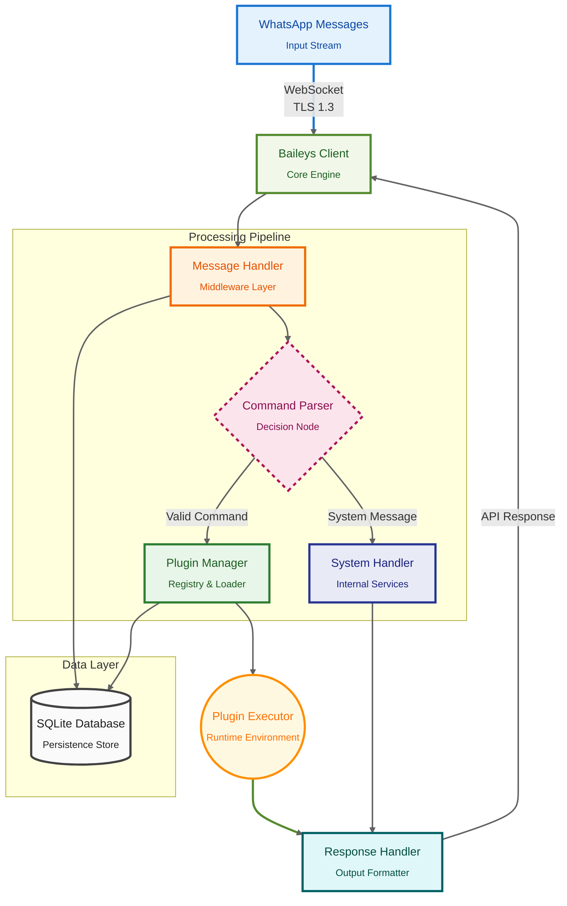
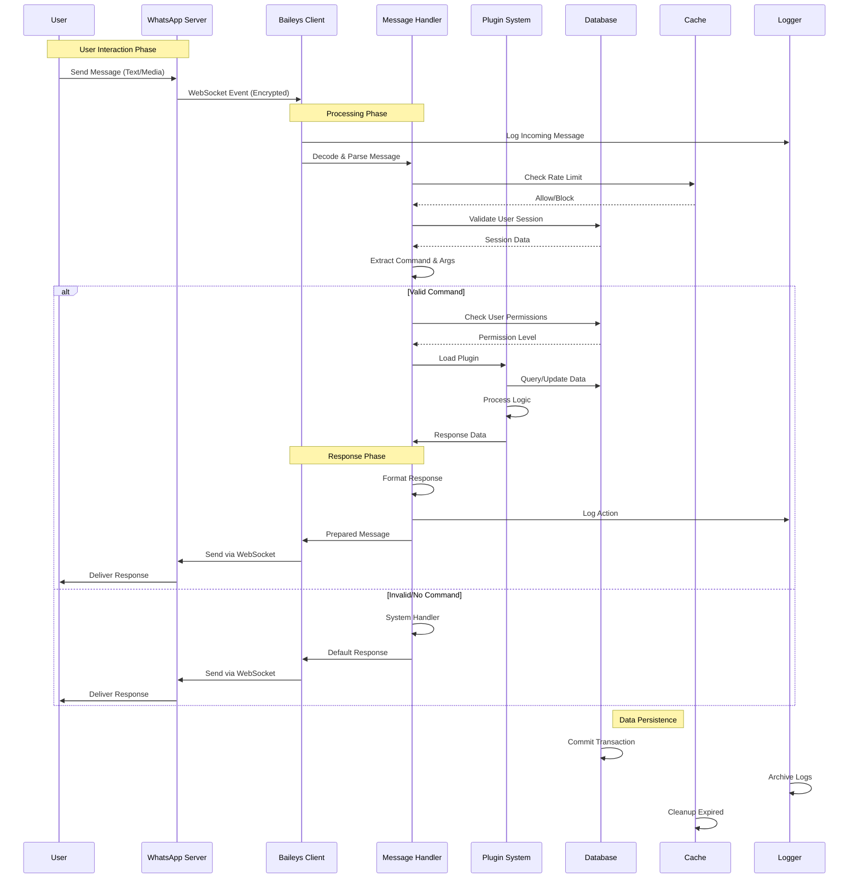

<div align="center">

<!-- Wave Header with Typing Animation -->


# 🌸 Liora

### Modern WhatsApp Bot Framework built on Baileys

<p align="center">
  <a href="https://bun.sh">
    
  </a>
  <a href="LICENSE">
    
  </a>
  <a href="https://developer.mozilla.org/en-US/docs/Web/JavaScript/Guide/Modules">
    
  </a>
  <a href="https://www.sqlite.org/index.html">
    
  </a>
</p>

---

</div>

Built on Baileys • Powered by Bun Runtime • Written in JavaScript

---

## 🚀 Overview

Liora is an enterprise-ready WhatsApp bot framework designed for developers who demand **performance**, **reliability**, and **scalability**. Built with modern technologies and battle-tested architecture patterns.

### 🏗️ Architecture Overview



### ✨ Key Features

<table>
<tr>
<td align="center" width="33%">

**⚡ Performance**


Ultra-fast Bun runtime
<br>3x faster than Node.js
<br>Minimal dependencies

</td>
<td align="center" width="33%">

**🎯 Architecture**


ESM-first design
<br>Plugin-based system
<br>Clean codebase

</td>
<td align="center" width="33%">

**💾 Database**


Native bun:sqlite
<br>No external services
<br>Lightweight storage

</td>
</tr>
<tr>
<td align="center" width="33%">

**🌐 Deployment**


Server ready
<br>Container support
<br>Pterodactyl compatible

</td>
<td align="center" width="33%">

**🎨 Rich Media**


Interactive buttons
<br>Carousels & albums
<br>Stories support

</td>
<td align="center" width="33%">

**🔐 Security**


Pairing code auth
<br>Owner-only commands
<br>Command blocking

</td>
</tr>
</table>

### 🔄 Message Flow



---

## 📸 Screenshots

### Interactive Menus

<p align="center">
  <br>
  <em>Main menu interface with options</em>
</p>

<p align="center">
  <br>
  <em>Category menu for easier navigation</em>
</p>

### Rich Media Support

<p align="center">
  <br>
  <em>Carousel view for multiple items with interactive buttons</em>
</p>

---

## ⚡ Quick Start

For detailed installation instructions, see **[INSTALLATION.md](.github/INSTALLATION.md)**

### Automated Installation for Linux (Ubuntu/Debian)

```bash
curl -fsSL https://raw.githubusercontent.com/naruyaizumi/liora/main/install.sh | bash
```

**Post-installation:**

```bash
bot config  # Configure settings
bot start   # Start the bot
bot log     # View logs
bot status  # Check status
```

### Manual Installation

See **[INSTALLATION.md](.github/INSTALLATION.md)** for comprehensive manual installation guide.

---

## ⚙️ Configuration

### Environment Setup

Edit `.env` with your configuration:

```bash
# Staff Configuration (WhatsApp LIDs)
OWNERS=["1234567890","1234567890"]

# Pairing Configuration
PAIRING_NUMBER=1234567890
PAIRING_CODE=CUMICUMI

# Bot Metadata
WATERMARK=Liora
AUTHOR=Naruya Izumi
THUMBNAIL_URL=https://

# Logger Configuration
LOG_LEVEL=info
LOG_PRETTY=true
BAILEYS_LOG_LEVEL=silent
```

**Important Notes:**

- Use WhatsApp **LIDs** (Local IDs), not phone numbers for OWNERS
- `PAIRING_NUMBER` must be in international format without `+` or spaces
- `PAIRING_CODE` should be 8 alphanumeric characters (auto-generated if empty)

### Pairing Your Device

1. Run the bot: `bun start`
2. Open WhatsApp on your phone
3. Go to **Linked Devices** > **Link a Device**
4. Enter the pairing code displayed in console
5. Done! Your bot is now connected

---

## 🎮 Usage

### Command Prefixes

Liora supports multiple prefixes:

```
.menu    # Dot prefix
!menu    # Exclamation
/menu    # Slash
```

### Built-in Commands

| Command           | Description          | Example |
| ----------------- | -------------------- | ------- |
| `.menu` / `.help` | Display command menu | `.menu` |
| `.ping`           | Check bot latency    | `.ping` |

### Interacting with the Bot

- **Main Menu**: Send `.menu` or `.help`
- **Category Menu**: Select category from button menu
- **Direct Command**: Use prefix + command name

---

## 🔌 Plugin System

### Plugin Structure

```
src/plugins/
├── info/              # Information commands
│   └── info-ping.js
├── owner/             # Owner-only commands
│   ├── owner-sf.js    # Save file
│   ├── owner-df.js    # Delete file
│   ├── owner-gf.js    # Get file
│   └── owner-reload.js
├── group/             # Group management
├── downloader/        # Media downloaders
├── ai/                # AI features
└── tool/              # Utility tools
```

### Creating a Basic Plugin

Create a file in `/src/plugins/[category]/[name].js`:

```javascript
/**
 * @file Ping command handler
 * @module plugins/info/ping
 * @license Apache-2.0
 * @author Naruya Izumi
 */

let handler = async (m, { conn }) => {
    const start = Bun.nanoseconds();
    const msg = await conn.sendMessage(m.chat, { text: "⏱️ Checking..." });
    const ns = Bun.nanoseconds() - start;
    const ms = (ns / 1_000_000).toFixed(0);

    await conn.sendMessage(m.chat, {
        text: `🏓 Pong! ${ms} ms`,
        edit: msg.key,
    });
};

handler.help = ["ping"];
handler.tags = ["info"];
handler.command = /^(ping)$/i;

export default handler;
```

### Plugin Properties

- `handler.help` - Command names for help menu
- `handler.tags` - Category tags
- `handler.command` - RegExp pattern for command matching
- `handler.owner` - Owner-only command (optional)
- `handler.premium` - Premium-only command (optional)
- `handler.group` - Group-only command (optional)
- `handler.admin` - Admin-only command (optional)

### Learn More

- **[PLUGINS.md](.github/PLUGINS.md)** - Complete plugin development guide
- **[BUTTONS.md](.github/BUTTONS.md)** - Interactive buttons & rich media
- **[API.md](.github/API.md)** - API integration & utilities

---

## 🚀 Production Deployment

### Using PM2

```bash
# Install PM2
npm install -g pm2

# Start bot
pm2 start ecosystem.config.js

# Save configuration
pm2 save

# Enable startup
pm2 startup

# Monitor
pm2 monit
```

### Using Systemd

Service file auto-created by installer at `/etc/systemd/system/liora.service`

```bash
sudo systemctl start liora
sudo systemctl enable liora
sudo systemctl status liora
```

---

## 📚 Documentation

- **[INSTALLATION.md](.github/INSTALLATION.md)** - Detailed installation guide
- **[PLUGINS.md](.github/PLUGINS.md)** - Plugin development guide
- **[BUTTONS.md](.github/BUTTONS.md)** - Interactive buttons & carousels
- **[API.md](.github/API.md)** - API utilities & helpers
- **[Contributing Guidelines](.github/CONTRIBUTING.md)** - How to contribute
- **[Security Policy](.github/SECURITY.md)** - Report vulnerabilities
- **[Code of Conduct](.github/CODE_OF_CONDUCT.md)** - Community standards

---

## 🤝 Contributing

<div align="center">

**Contributions are welcome!** 💖

See [CONTRIBUTING.md](.github/CONTRIBUTING.md) for details.

</div>

---

## 💬 Community

<div align="center">

**Join our growing community!**

<table>
<tr>
<td align="center" width="50%">

**💭 WhatsApp Group**


Ask questions, share ideas,
and get help from community

<br><br>

[](https://chat.whatsapp.com/FtMSX1EsGHTJeynu8QmjpG)

</td>
<td align="center" width="50%">

**📡 Baileys Community**


Official Baileys developer hub
on Discord

<br><br>

[](https://discord.gg/baileys)

</td>
</tr>
</table>

</div>

## 🔒 Security

**Report vulnerabilities to:** liora.bot.official@gmail.com

> [!WARNING]
> **DO NOT** report security issues through public GitHub issues.

See [SECURITY.md](.github/SECURITY.md) for our security policy.

---

## 📄 License

Licensed under the **Apache License 2.0**. See [LICENSE](LICENSE) for full details.

> [!CAUTION]
> Removing copyright notices or claiming original authorship violates the license and may result in legal action.

---

## 💖 Acknowledgments

**Built with passion by developers, for developers**

### 🚀 Core Technologies

<p align="left">
  <a href="https://bun.sh">
    
  </a>
  <a href="https://github.com/WhiskeySockets/Baileys">
    
  </a>
  <a href="https://www.javascript.com/">
    
  </a>
  <a href="https://www.sqlite.org/">
    
  </a>
</p>

### 🛠️ Development Tools

<p align="left">
  <a href="https://eslint.org/">
    
  </a>
  <a href="https://prettier.io/">
    
  </a>
  <a href="https://codeql.github.com/">
    
  </a>
  <a href="https://github.com/features/actions">
    
  </a>
</p>

### 🙏 Community & Contributors

- 💚 All [contributors](https://github.com/naruyaizumi/liora/graphs/contributors) who made this possible
- 🌍 The amazing open-source community
- ⭐ Everyone who starred this repository
- 🐛 Bug reporters and feature requesters

---

<div align="center">

  <!-- Repobeats Analytics -->
  <p><strong>📊 RepoBeats Analytics</strong></p>
  

  <!-- Star History -->
  <p><strong>🌟 Star History</strong></p>
  <a href="https://star-history.com/#naruyaizumi/liora&Date">
    
  </a>

  <hr/>

  <p><strong>Maintained by the Liora community || <a href="https://github.com/naruyaizumi">© 2024 - 2026 Naruya Izumi</a></strong></p>
  
<br/><br/>

  

</div>