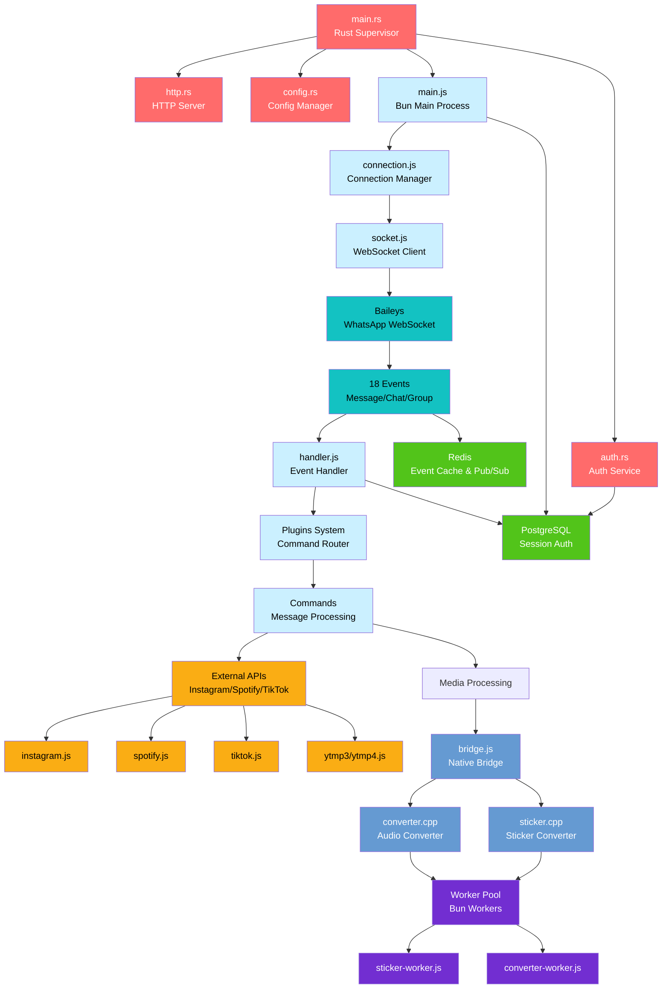

<div align="center">


# 🌸 Liora

### Enterprise-Grade WhatsApp Bot

**Built on Baileys • Powered by Bun • Supervised by Rust • Cached with Redis • Persisted by PostgreSQL**

<p align="center">
  <a href="https://bun.sh">
    
  </a>
  <a href="https://www.rust-lang.org">
    
  </a>
  <a href="https://www.postgresql.org">
    
  </a>
  <a href="https://redis.io">
    
  </a>
  <a href="https://ffmpeg.org">
    
  </a>
  <a href="https://www.sqlite.org">
    
  </a>
  <a href="https://cmake.org">
    
  </a>
  <a href="https://nodejs.org">
    
  </a>
  <a href="https://developer.mozilla.org/en-US/docs/Web/JavaScript">
    
  </a>
  <a href="https://isocpp.org">
    
  </a>
  <a href="https://www.kernel.org">
    
  </a>
  <a href="LICENSE">
    
  </a>
  <a href="https://github.com/naruyaizumi/liora/releases">
    
  </a>
  <a href="https://github.com/naruyaizumi/liora/actions">
    
  </a>
</p>

---

</div>

## 🎯 Why Liora?

**Liora** is not just another WhatsApp bot—it's a **production-ready** designed for developers who demand **performance**, **reliability**, and **scalability**. Built with modern technologies and battle-tested architecture patterns.

### 🏗️ Modern Architecture



> [!IMPORTANT]
> **Breaking Changes in v8.0.0**  
> This is a major architecture overhaul. Migration from v7.x requires database setup and configuration changes.

> [!CAUTION]
> **Security Disclosure Policy**  
> Do not publicly disclose vulnerabilities. Report security issues responsibly through our [security policy](.github/SECURITY.md).  
> This protects the integrity and trust of the entire Liora ecosystem.

> [!WARNING]
> **License Compliance**
>
> - **DO**: Use freely, modify, distribute with attribution
> - **DON'T**: Remove credits, rebrand for profit, or violate Apache 2.0 terms
>
> Credits represent **respect, transparency, and acknowledgment**—not decoration.

---

## ✨ Features

### 🚀 Core Capabilities

<table>
<tr>
<td width="50%" valign="top">

**🔥 Production Architecture**

- Rust supervisor with crash recovery
- Multi-process isolation
- Graceful shutdown & hot-restart
- Automatic health monitoring
- Signal handling (SIGTERM/SIGINT)

**⚡ High Performance**

- Native Bun WebSocket (no `ws` dependency)
- Redis connection pooling
- PostgreSQL session management
- Async event processing with PQueue
- Circuit breaker for external APIs

**🔒 Enterprise Security**

- PostgreSQL persistent auth
- Redis encrypted cache
- Input sanitization
- Rate limiting on APIs
- Security audit tools

</td>
<td width="50%" valign="top">

**🧩 Developer Experience**

- Hot-reload plugins (zero downtime)
- ESM modules throughout
- Type-safe patterns
- Clean code architecture
- Comprehensive error handling

**📊 Observability**

- Structured logging (Pino)
- Prometheus metrics endpoint
- Health check APIs
- Performance benchmarks
- Debug mode support

**🔌 Extensibility**

- Plugin-based architecture
- C++ native addons
- Custom command system
- Event hook system
- API middleware support

</td>
</tr>
</table>

---

## 🚀 Quick Start

### ⚡ One-Line Installation

```bash
curl -sSL https://raw.githubusercontent.com/naruyaizumi/liora/main/service.sh | bash
```

</div>

---

## 🤝 Contributing

<div align="center">

**Contributions are welcome!** 💖

All types of contributions are valuable - bug fixes, features, docs, or feedback.

</div>

### 📝 How to Contribute

```bash
# 1. Fork & Clone
git clone https://github.com/YOUR_USERNAME/liora.git
cd liora

# 2. Create Branch
git checkout -b feature/YourFeature

# 3. Make Changes
# - Follow code style
# - Test changes
# - Update docs
```

### 🚀 Submit Changes

```bash
# 4. Commit & Push
git commit -m "✨ Add YourFeature"
git push origin feature/YourFeature

# 5. Open Pull Request
# - Describe changes
# - Link issues
# - Wait for review
```

### 📋 Pull Request Checklist

- [ ] Code follows the project's style guidelines
- [ ] Tests added/updated and passing
- [ ] Documentation updated (if applicable)
- [ ] Commit messages are clear and descriptive
- [ ] Branch is up to date with main/master

<div align="center">

### 🌟 Top Contributors

<a href="https://github.com/naruyaizumi/liora/graphs/contributors">
  
</a>

</div>

---

## 💬 Community

<div align="center">

**Join our growing community!**

<table>
<tr>
<td align="center" width="50%">

**📢 GitHub Discussions**


Get latest updates, releases,
and announcements directly on GitHub

<br><br>

[](https://github.com/naruyaizumi/liora/discussions)

</td>
<td align="center" width="50%">

**💭 WhatsApp Group**


Ask questions, share ideas,
and get help from community

<br><br>

[](https://chat.whatsapp.com/FtMSX1EsGHTJeynu8QmjpG)

</td>
</tr>
<tr>
<td align="center" width="50%">

**📡 Baileys Community**


Official Baileys developer hub
on Discord

<br><br>

[](https://discord.gg/baileys)

</td>
<td align="center" width="50%">

**❤️ Owner Socials**


Connect with me, follow updates,
and explore my projects

<br><br>

[](https://linkbio.co/naruyaizumi)

</td>
</tr>
</table>

</div>

---

## 📜 License

Liora is released under the **Apache License 2.0**, a permissive open-source license that allows you to:

- Use the code freely for personal or commercial projects
- Modify and adapt it to fit your needs
- Distribute your own versions, as long as you include proper attribution
- Contribute improvements back to the community

However, the license also ensures that:

- You must include a copy of the license in any distribution
- You cannot hold the authors liable for damages
- You must clearly state changes if you modify the code

See the full license text in [LICENSE](LICENSE) for all details.

---

**Copyright © 2024 Naruya Izumi**  
Maintained by the Liora community.
Contributions, forks, and pull requests are welcome!

---

<div align="center">

  <p><strong>🌟 Star History</strong></p>
  <a href="https://star-history.com/#naruyaizumi/liora&Date">
    
  </a>

</div>
